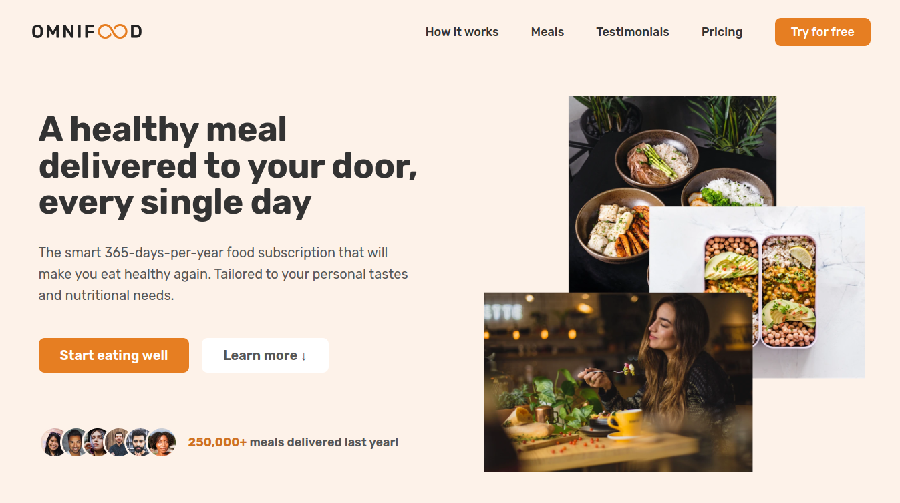
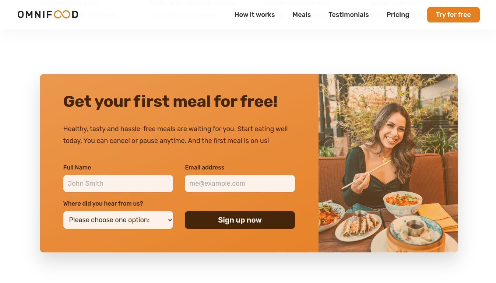
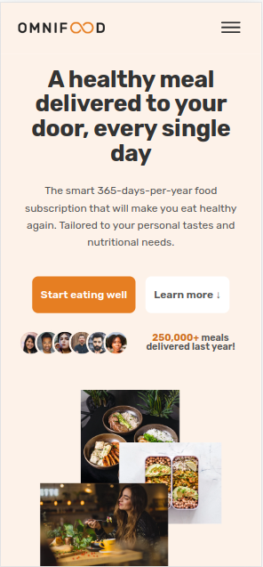

# Omnifood

[Acesse o Omnifood aqui!](https://g101-omnifood.netlify.app)

## Sobre o projeto

O Omnifood é uma landing page fictícia que oferece uma assinatura de comida saudável.

Neste projeto, coloquei conceitos em pratica sobre tipografia, whitespace, sombras, cores, efeitos, flexbox, grid, responsividade.

### Screenshots

#### Desktop




#### Mobile:



### CORES

```css
- Primary: #e67e22
- Tints:
#fdf2e9
#fae5d3
#eb984e

- Shades:
#cf711f
#45260a

- Accents:
- Greys
#888
#767676
#555
#333
```

### FONTES

- Family: [Rubik](https://fonts.google.com/specimen/Rubik)
- Weights: 400, 500, 700
